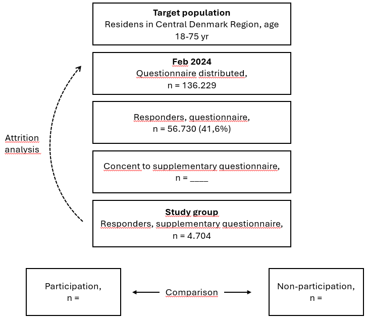

TODO: 
- synkroniser qmd med docx

- Ændre deltagelse til outcome fremfor eskponering. 
- Slette DAGs og beskrive argumentation for variable i baggrund og tabel. Studiet undersøger associationer og ikke causalitet.
- Lave et nyt flowchart. (Target population: T2D i regionen)
- Argumentere for dikotomisering vs kontinuerlig variabel. hvis vi behandler spørgeskemaer som kontinuerlig variabel, såantager vi liniær sammenhæng. Altså en lige betydningsfuldt spring uanset hvor springet foregår på skalaen. Inden vi foretager den antagelse, kan vi teste den med splines. Afhængig af svaret, kan vi dikotomisere eller gå med kontinuerte variable. 
Vi kan komme omkring spørgsmålet om at dikotomisere ved at tydeligegøre antagelsen. Depressive personer er mindre tilbøjelige til at få et tilbud end ikke-depressive (dikotimisere). Eller hvordan påvirker graden af depression, sandsynligheden for at få et tilbud (kontinuerligt). 
- Ændre rækkefølge på studierne: 1, 1,5 adressere vægtning baseret på dem der har fået invitation til ekstraundersøgelsen (OBS laver jeg også tabel for dem?), 2, Udarbejde tabel for dem som har besvaret, udarbejde 2x tabeller for den vægtede analyse (1x univariabel logistisk reg., 1x multivariabel reg.)
- Lave x antal personaer, fra "mest heldig" til "mest uheldig" baseret på variablerne
- Baseret på den multivariable regressionsanalyse, udregner vi sansynlighed for at de forskellige personeaer, vil få et tilbud. 

# 1 Introduction

## Challenges regarding use of municipal services

The prevalence of type 2 diabetes is increasing worldwide. In Denmark, the prevalence has increased from 260.000 in 2017 to 348.000 in the end of 2025 [@diabetestal]. Projections further indicate that the prevalence of type 2 diabetes is expected to rise to 325.068 [@carstensen2020].

Type 2 diabetes is associated with substantial morbidity and premature mortality, including increased risks of cardiovascular disease, chronic kidney disease, neuropathy, retinopathy, and several forms of cancer [@GBD2023; @Einarson2018; @laurberg2024]. Beyond its physical health consequences, type 2 diabetes is associated with substantial psychosocial burden, including diabetes-related emotional distress, reduced quality of life, and the ongoing demands of complex self-management [@Perrin2017; @Bailey2011; @ADA2025Standards]. These factors are well documented as barriers to treatment adherence and effective self-care, and are associated with suboptimal engagement in healthcare and poorer health outcomes [@Gonzalez2008].

Diabetes self-management programmes (DSMPs) are considered a central component of type 2 diabetes care, as they aim to support individuals in managing their disease in everyday life through education, behavioral support, and lifestyle interventions . In Denmark, responsibility for DSMPs lies within the regional healthcare system, while programme delivery is primarily undertaken by the municipalities [@MarkleReid2018; @Miklavcic2020; @Kanaley2022; @Steinsbekk2012; @Murphy2017; @Johansen2017; @Umpierre2013; @Colberg2016; @OHagan2013; @DeNardi2018; @Ryan2020]. The recent Danish healthcare reform aims to create more uniform and accessible DSMPs across the country [@Sundhedsreform2024]. However, despite their widespread implementation, relatively little is known about the effectiveness of municipality-based DSMPs in Denmark.

Furthermore, there is currently no national register that systematically tracks the utilization of municipal health services. As a result, knowledge remains limited regarding how many people with type 2 diabetes make use of DSMPs and whether these services reach the individuals with the greatest need for support. In 2023, Diabetesforeningen conducted a survey among its members indicating that approximately 20% reported having been referred to municipal services, while a similar proportion reported unmet support needs [@Diabetesforeningen2023]. However, these findings may be affected by selection bias and may not reflect utilization patterns in the broader population of people living with type 2 diabetes.

In addition, practical barriers may further limit participation in DSMPs. Many programmes are delivered during standard working hours, which may reduce accessibility for individuals who are still active in the workforce. This may particularly affect younger individuals diagnosed earlier in life, who may have competing work and family responsibilities.

## How the project will contribute to solving the challenges

The LIVING project was launched back in 2023 to investigate the effectiveness of three different DSMPs [@Jensen2025]. In addition we have form out a workpackage (WP0) within the LIVING trial, to investigate the utilization of municipal health services.

The broader goal is to reduce health inequilities among people living with type 2 diabetes and make municipality based DSMPS more assesible for the people most in need. This project will give insights into who and how many make use of the services.

## Novelty of the project

Existing knowledge on utilization of municipality-based DSMPs in Denmark is limited, and most evidence is based on survey studies that do not include attrition analyses. As a result, it is generally unknown whether study samples reflect the underlying target population of people living with type 2 diabetes,

This project addresses this limitation by explicitly assessing participation and non-participation in DSMPs using an attrition framework.

Self-reported measures capture health behaviors and psychosocial factors such as BMI, smoking, physical activity, diabetes duration, well-being (WHO-5), health literacy (HLQ), diabetes distress (PAID), and perceived disease burden, while register data provide objective indicators including HbA1c, cholesterol, comorbidity (NMI), education, income, cohabitation status, and country of origin. Together, these data allow identification of potential selection patterns in DSMP participation that cannot be detected using either data source alone.

## Expected impact

The project is expected to strengthen knowledge regarding the utilization of municipality-based DSMPs among people living with type 2 diabetes in Denmark. By identifying who participates in DSMPs, and who does not, the project may help inform a more equitable organization of municipal health services.

The findings may provide important insights into potential gaps between service availability and actual utilization, including whether current services reach population groups with the greatest need for support. In addition, the project may contribute to the development of more accessible and flexible DSMPs by identifying barriers related to participation and healthcare engagement.

In the longer term, improving access to and utilization of DSMPs may contribute to better diabetes self-management, improved health outcomes, and reduced health inequities among people living with type 2 diabetes.

# 2 HICD data

The HICD cohort is a research initiative designed to investigate diabetes and its associated complications in the Central Denmark Region, which has a population of around 1.3 million residents. Using registry data and a predefined algorithm for diabetes classification, researchers identified individuals aged 18 to 75 years with prevalent diabetes. In addition, a control group of equal size was established, matched on sex, age, and municipality, consisting of individuals without diabetes.

In 2024, $n = 56,730$ (41.6%) out of $n = 136,229$ individuals completed the HICD questionnaire. Of these, \$n = ??? \$ consented to receive a supplementary questionnaire focusing on participation in municipal health services. Among those invited, $n = 4,704$ completed the supplementary questionnaire.

# 3 WP0 Components

WP0 consists of three research components:

1.  A mapping component investigating the proportion of individuals with type 2 diabetes who have received municipal health services.

2.  A comparative component examining differences between participants and non-participants in municipal programs with regard to health literacy, mental health, quality of life, sociodemographic characteristics, and clinical outcomes.

3.  An attrition analysis evaluating potential selection bias by comparing respondents to the supplementary survey with the overall Health in Central Denmark population.

## 3.1 Mapping

### Objective

To quantify the proportion of individuals with type 2 diabetes who have been in contact with municipal health services, based on data from the supplementary Health in Central Denmark (HICD) survey conducted in autumn 2024.

### A priori hypothesis

We hypothesise that the proportion of participants reporting contact with municipal health services will be comparable to previous survey findings, where approximately 20% reported having been referred to municipal services and a similar proportion indicated unmet needs [@Diabetesforeningen2023]. Furthermore, we hypothesise that the majority of respondents will report no perceived need for municipal health services.

### Study population

The study population comprises adults aged 18–75 years with type 2 diabetes who completed the supplementary HICD questionnaire in 2024 ($n = 4,704$).

### Operationalisation of municipal health services

Exposure to municipal health services will be defined based on self-reported responses to the following items, all referring to the past five years:

-   **Referral from general practitioner:** "Has your healthcare provider referred you to a consultation or program in the municipality within the past 5 years?"
-   **Diet counselling:** "Within the past 5 years, have you been offered support to change dietary habits by the municipality?"
-   **Physical activity/exercise programme:** "Within the past 5 years, have you been offered support for physical activity and/or exercise by the municipality?"
-   **DSMP:** "Within the past 5 years, have you been offered support for managing your diabetes treatment by the municipality?"
-   **Mental health support:** "Within the past 5 years, have you been offered support for managing the psychological aspects of living with diabetes by the municipality?"

For each item, respondents will be categorised using the following response options:

-   Yes, and I accepted the offer
-   Yes, but I did not accept the offer
-   No, but I contacted the municipality myself
-   No, but I would have liked the offer
-   No, I do not need it
-   Not relevant
-   Don't know

### Statistical analysis

Descriptive statistics will be used to summarise the data. For each municipal service item, the number and proportion (n, %) of respondents in each response category will be reported.

Results will be presented in tables, including overall distributions as well as stratified analyses by sex, employment status, and age group ($<65$ years vs. $\geq 65$ years).

**Example of table structure**

| Exercise programme                          | N   | Percentage (%) |
|---------------------------------------------|-----|----------------|
| Yes, and I accepted the offer               |     |                |
| Yes, but I did not accept the offer         |     |                |
| No, but I contacted the municipality myself |     |                |
| No, but I would have liked the offer        |     |                |
| No, I do not need it                        |     |                |
| Not relevant                                |     |                |
| Don't know                                  |     |                |
| Missing                                     |     |                |
| Total                                       |     |                |

## 3.2 Comparison of DSMP participants vs. non-participants

### Study design

Cross-sectional observational study based on survey data linked with register-based information.

This component will be conducted as a comparative analysis of baseline characteristics between exposure groups, without assumptions of causality.

### Objective

To describe and compare demographic, socioeconomic, clinical, and psychosocial characteristics between individuals who have participated in municipal DSMPs and those who have not participated.

### Exposure definition

The primary exposure is self-reported participation in a municipal DSMP.

Participation is defined as having attended a municipal DSMP within the past five years, either through referral by a general practitioner or self-referral.

Non-participation is defined as not having participated in a municipal DSMP within the past five years, regardless of whether the individual would have liked the offer.

Respondents answering "Don't know" will be excluded from the analyses.

**Response categories and coding:**

| Response category                                | Coding   |
|--------------------------------------------------|----------|
| Yes, and I accepted the offer                    | 1        |
| Yes, but I did not accept the offer              | 0        |
| No, but I would have liked the offer             | 0        |
| No, but I have contacted the municipality myself | 1        |
| No, I do not need it                             | 0        |
| Not relevant                                     | 0        |
| Don't know                                       | Excluded |

An alternative exposure definition based solely on *Yes, but I did not accept the offer* will be explored in sensitivity analyses.

### Outcome measures

To identify characteristics considered relevant for describing and comparing individuals who participated in a DSMP with those who did not, a directed acyclic graph (DAG) was developed. During this process, participation in a DSMP was treated as the node of interest, and socioeconomic, disease-related, and psychosocial factors were specified as potential determinants of participation. The DAG was not developed to estimate a causal effect of DSMP participation, but rather to provide a transparent framework for selecting variables considered relevant characteristics of participants and non-participants and to make assumptions regarding the relationships between these variables explicit.

#### Socioeconomic resource

These factors may affect awareness of services, transportation options, ability to navigate the healthcare system and attend Danish speaking services. 

**Country of origin (Danish, immigrant, descendant)**

Country of origin may influence educational attainment through language proficiency, migration history, and educational opportunities. Education may subsequently influence awareness of available municipal services and the ability to navigate the healthcare system. Even after accounting for education, country of origin may directly influence participation through language barriers, cultural beliefs, trust in public services, or familiarity with preventive healthcare programs.

Country of origin ─────► Language barrier ─────► Participation
        │
        ▼
   Education ─────► Income ─────► Participation
        │               │
        │               ▼
        └────────► Cohabitation ─────► Participation

**Education - Highest attained educational level (short, medium, long)**

Educational attainment influences employment opportunities and earning potential. Individuals with higher incomes may have greater flexibility regarding transportation, time, and resources needed to participate. Education may also affect participation independently of income through health knowledge, self-efficacy, and ability to engage with health information.

Education ────────► Participation
     │
     ▼
   Income ─────► Participation
   
**Income - Equivalized disposable household income (quintiles)**

Economic resources influence family formation and living arrangements. Living with a partner may increase participation through practical support, encouragement, or assistance with transportation and scheduling. Income may affect participation directly through available resources and opportunity costs.

Income ─────► Participation
  │               │
  │               ▼
  └────────► Cohabitation ─────► Participation
  

**Cohabitation/marital status (cohabiting/married vs. living alone)**

Living with a partner may increase participation through practical support, encouragement, or assistance with transportation and scheduling.

Cohabitation ─────► Participation

#### Disease severity

These factors reflect biological disease burden, metabolic control, comorbidity, and behavioural and psychological consequences of living with type 2 diabetes. They may influence participation through clinical need, functional limitations, symptom burden, and contact with healthcare services.

Diabetes duration ───────────────► HbA1c ───────────────► Perceived disease burden ─────► Participation
        │                              │                             ▲
        │                              │                             │
        │                              ▼                             │
        │                        BMI ────────────────────────────────┤
        │                              │                             │
        │                              ▼                             │
        │                        Physical activity ──────────────────┤
        │                              │                             │
        │                              ▼                             │
        │                        Smoking status ─────────────────────┤
        │                              │                             │
        ▼                              ▼                             │
Comorbidity (NMI) ───────────────► Cholesterol ─────────────────────┘

**Diabetes duration (years since diagnosis)**

Longer disease duration reflects cumulative exposure to hyperglycaemia and progressive metabolic deterioration. It is expected to influence glycaemic control and downstream disease burden, which may increase perceived need for support and contact with healthcare services.

**HbA1c (glycaemic control)**

HbA1c reflects current metabolic control and is a key clinical marker of diabetes severity. Poor glycaemic control may lead to increased symptom burden and clinical attention, potentially increasing referral or motivation for participation in DSMPs. It is also linked to other metabolic indicators such as BMI and cholesterol.

**Body mass index (BMI)**

BMI reflects adiposity and metabolic health and is closely linked to insulin resistance and glycaemic control. Higher BMI may be associated with reduced physical functioning and may influence lifestyle behaviours such as physical activity.

**Smoking status**

Smoking is a marker of health behaviour and is often clustered with other lifestyle risk factors such as low physical activity. It may reflect general self-management patterns and engagement in health-promoting behaviour.

**Physical activity**

Physical activity reflects functional capacity and health behaviour. Lower activity levels may indicate poorer health status and may both reflect and contribute to higher perceived disease burden and reduced engagement in self-management. 

**Perceived disease burden**

Perceived disease burden captures the subjective experience of living with diabetes, including symptom load and psychological strain. It integrates multiple upstream indicators of disease severity and is expected to be a proximal driver of participation

**Total cholesterol**

Total cholesterol reflects metabolic and cardiovascular risk and is influenced by comorbidity and overall metabolic control. It is considered an intermediate biological marker of disease severity.

**Comorbidity (Nordic Multimorbidity Index, NMI)**

Comorbidity reflects overall disease burden beyond diabetes and is a marker of multimorbidity. Higher comorbidity may worsen metabolic control and increase healthcare contact, which may facilitate referral to DSMPs.

#### Psychological resources

These factors reflect cognitive, emotional, and behavioural capacities that influence how individuals perceive, manage, and respond to living with type 2 diabetes. They may affect participation in DSMPs through motivation, perceived need, self-efficacy, and ability to engage with healthcare services.

Personality traits ─────► Health literacy ─────► Participation
                                │
                                ▼
                        Diabetes distress ─────► Participation
                                │
                                ▼
                     Quality of life and Well-being ─────► Participation

**Personality traits**

Personality traits (e.g. conscientiousness, neuroticism, extraversion) reflect stable behavioural tendencies that influence coping style, help-seeking behaviour, and engagement with health services. They are upstream determinants of health literacy, emotional responses, and self-management behaviour.

**Health literacy (HLQ)**

Health literacy reflects the ability to access, understand, and use health information. Higher health literacy may improve understanding of available DSMPs, increase perceived relevance, and strengthen engagement with self-management support.

**Diabetes distress (PAID)**

Diabetes distress captures emotional burden specifically related to living with diabetes, including frustration, worry, and perceived inability to manage the condition.

**Quality of life and Well-being (SF-12 and WHO-5)**

SF-12 captures overall self-reported physical and mental health status, while WHO-5 measures subjective psychological well-being. Together, they reflect general health functioning and emotional well-being. Individuals with poorer perceived health status or lower well-being may have greater perceived need for support and therefore be more likely to engage in structured diabetes management programs. Conversely, better health and well-being may be associated with lower perceived need, potentially reducing participation.
                          

**Self-reported measures (HICD):**

-   Body mass index (BMI)
-   Smoking status
-   Physical activity level
-   Diabetes duration
-   Personality traits
-   WHO-5 Well-Being Index
-   Health Literacy Questionnaire (HLQ)
-   Problem Areas in Diabetes (PAID) scale
-   SF-12 (or SF-1 in sensitivity analyses)
-   Perceived disease burden

Where relevant, validated scoring procedures will be applied according to instrument-specific guidelines.

**Register-based measures (Statistics Denmark):**

-   HbA1c
-   Total cholesterol
-   Comorbidity: Nordic Multimorbidity Index (NMI)
-   Socioeconomic indicators:
    -   Highest attained educational level (short, medium, long)
    -   Equivalized disposable household income (quintiles)
-   Cohabitation/marital status (cohabiting/married vs. living alone)
-   Country of origin (Danish, immigrant, descendant)

### Covariates

-   Age
-   Sex (male, female)

Age will additionally be explored in categorical and continuous form in sensitivity analyses to assess potential non-linear associations.

### Statistical analysis

Descriptive statistics will be used to characterise the study population across exposure groups.

Continuous variables will be presented as mean (SD) or median (IQR) depending on distribution, and categorical variables as frequencies and percentages.

Outcome variables from the questionnaire will be dichotomised into high and low scores. In cases where internationally recognised cut-off values are not available, cohort-specific medians will be used as the threshold for classification.

Group comparisons according to participation status will be summarised in tabular form. Both crude and adjusted odds ratios will be reported for WHO-5, SF-12, HLQ, and PAID, with outcomes dichotomised into high versus low scores. 

Noget med "a logistic regression where we mutually adjust for the co-variates

Adjusted estimates will be derived using modified Poisson regression, accounting for age, sex, socioeconomic position, and comorbidity measured by the Nordic Multimorbidity Index (NMI).

Differences in categorical outcomes between expesed and non-exposed will be evaluated using chi-squared tests.

The NMI will initially be modelled as a continuous variable. Its functional form will be examined using natural cubic splines, and if deviations from linearity are identified, spline terms will be incorporated into the final models.

All analyses will be performed in R, and results will be reported with corresponding 95% confidence intervals.

## 3.3 Attrition analysis

### Study design

Cross-sectional attrition analysis based on linked survey and register data.

### Objective

The objective of the attrition analysis is to assess potential selection bias by comparing respondents to the supplementary questionnaire with the overall population of individuals with type 2 diabetes included in the HICD cohort.

### Study population

The study group will be defined as individuals who completed the supplementary questionnaire in 2024 ($n = 4,704$).

The comparison group (background group) will be defined as individuals who either completed the 2024 HICD questionnaire but did not consent to receive the supplementary questionnaire, or who provided consent but did not complete the supplementary questionnaire during the data collection period.

### Variables included in the attrition analysis

The following variables will be used to compare respondents and non-respondents:

**Demographic variables**\
- Age\
- Sex\
- Country of origin\

**Socioeconomic variables** - Highest attained educational level\
- Equivalized disposable household income\
- Cohabitation/marital status\

**Clinical variables** - Diabetes duration\
- HbA1c\
- Cholesterol\
- Comorbidity measured using the Nordic Multimorbidity Index (NMI)\

Register-based variables will be prioritized to minimize the influence of missing self-reported data.

### Statistical analysis

The statistical analysis will be carried out in the same manor as the comparison of DSMP participation and non-participation.

# 4 Time scale

The analysis plan will be uploaded to Open Science Framework (OSF) for timestamping before beginning the analyses. The WP0 will be performed in 2026.

# 5 Perspectives

This project may contribute important knowledge for future planning and prioritization of municipality-based DSMPs in Denmark. By providing population-based data on who participates in municipal services, and who does not, the project may help identify potential inequalities in access and utilization across demographic, socioeconomic, and clinical groups.

The findings may support municipalities, regions, and national health authorities in evaluating whether current services adequately reach individuals with the greatest need for support. In addition, the project may provide evidence relevant to ongoing implementation of the Danish healthcare reform, including decisions regarding organisation, accessibility, and allocation of resources within municipality-based diabetes care.

More broadly, the project may contribute to the development of more targeted and equitable preventive health strategies for people living with type 2 diabetes, with the potential to improve population health and reduce long-term healthcare costs.

# 6 References

See bibtex.qmd
